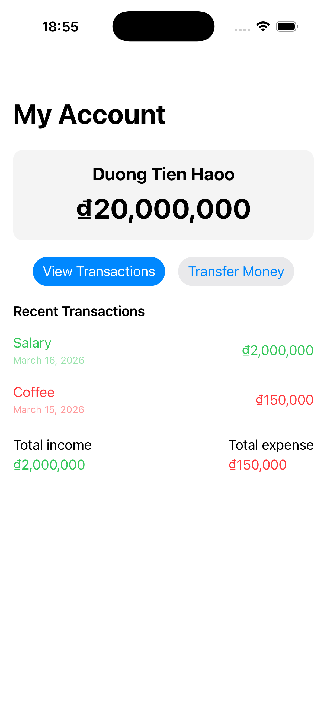
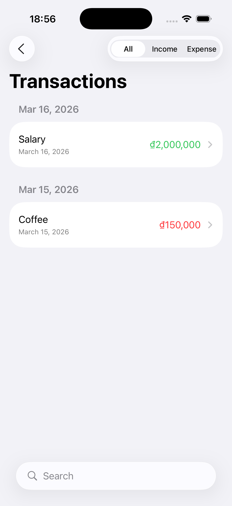
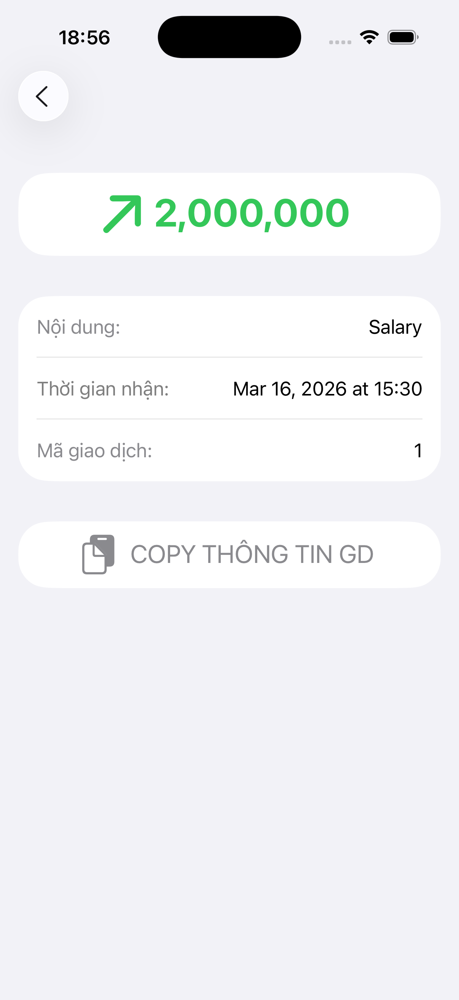

# BankingClone

A simple mobile banking app clone built with SwiftUI to practice MVVM, state management, and async data flow.

## Highlights
- MVVM architecture (View → ViewModel → Service)
- State machine: loading / success / error
- Mock API + local JSON integration
- Local cache for fast startup
- Transaction detail + copy reference
- Pull to refresh, filter, search

## Architecture
View
↓
ViewModel
↓
Service
↓
Mock / Local JSON
## Screens
- Dashboard
- Transactions list
- Transaction detail

## Tech Stack
- SwiftUI
- Swift Concurrency (async/await)
- SwiftData (basic)
- Local JSON / caching

## Getting Started
1. Open `BankingClone.xcodeproj`
2. Run on iOS Simulator (iOS 17+)

## Roadmap
- Real API integration
- Unit tests for ViewModel
- Enhanced empty/loading states

## Screenshots

